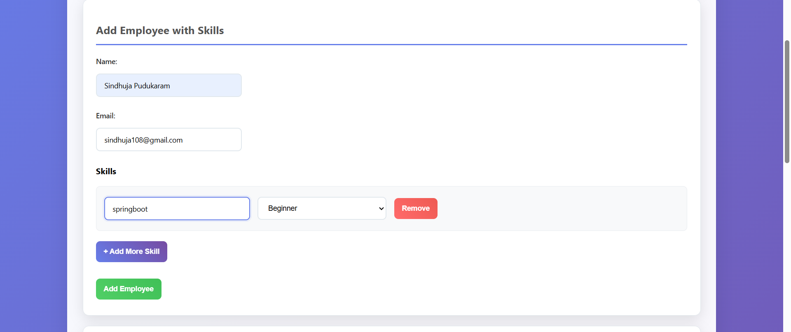
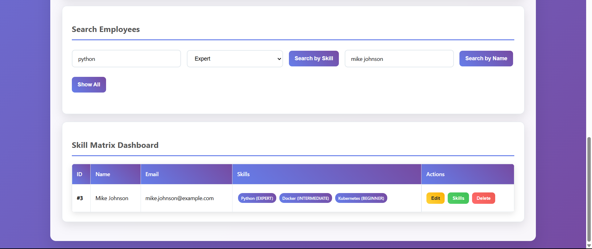
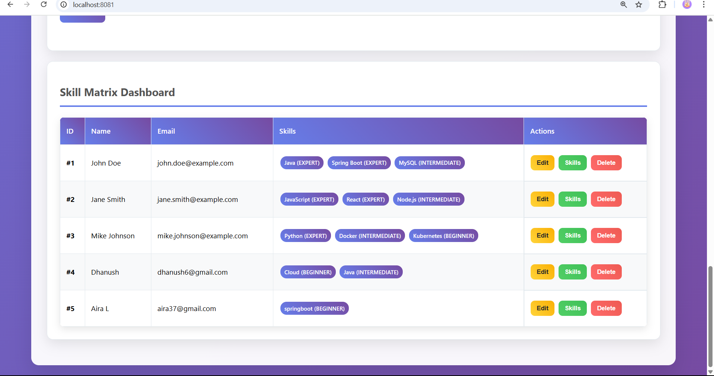

# Employee-Skill-Management
Track, manage, and utilize employee skills efficiently. A web-based system built with Java (Spring Boot) + MySQL that allows organizations to manage employee skill inventories, assess proficiency levels, and streamline project team formation.

# 👨‍💻 Employee Skill Management System

> **Track, manage, and utilize employee skills efficiently.**  
> A web-based system built with **Java (Spring Boot) + MySQL** that allows organizations to **manage employee skill inventories**, **assess proficiency levels**, and **streamline project team formation**.


---

## ✨ Features

- 👨‍💼 **Employee Skill Inventory:** Add, edit, and delete employees with their skills.  
- 📊 **Proficiency Tracking:** Assign proficiency levels for each skill per employee.  
- 🔍 **Search & Filter:** Quickly locate employees based on skills or proficiency levels.  
- ⚡ **Team Formation:** Identify the **best-fit employees for projects** based on required skills.  
- 🖥️ **Simple Web Interface:** Built with **HTML, CSS, JS** for easy access and management.

---

## 🏗️ Tech Stack

**Backend:** Java (Spring Boot)  
**Database:** MySQL  
**Frontend:** HTML, CSS, JavaScript  
**ORM / Data Access:** JDBC   
**Server:** Apache Tomcat (embedded in Spring Boot)

---

## 📊 How It Works

1. **Admin/User** can add employees and assign their skills with proficiency levels.  
2. Skills are stored in the **MySQL database** for quick search and retrieval.  
3. **Search** feature allows filtering employees based on skills to **form project teams efficiently**.  
4. Admin can **view, edit, or delete** employee records.

---

## 🚀 Demo Output Screens

### ➕ Add Employee Screen


### 🔍 Search Employees Screen


### 📋 View All Employees


---

## ⚡ Quick Start

1. **Clone the repository**
   ```bash
   git clone https://github.com/username/Employee-Skill-Management.git
   cd Employee-Skill-Management


